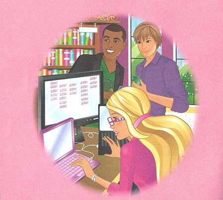
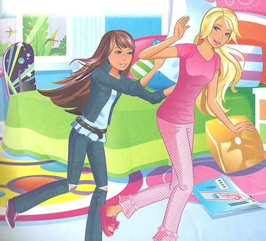

<h1>Hacker Barbie Visits the Agency</h1>

"We're just going to have to black bag them" Barbie said, frustrated by her
lack of progress on the contract. Dismayed, her client Brian pleaded "But
you're the hacking goddess!" Barbie replied flatly "My gender has nothing to do
with whether or not it's possible to remote root an OpenBSD box with no ports
open", making a mental note to talk to her PR firm about combating unrealistic
expectations.

"...and while he's distracted by Alpha team's 'pretty young thing', Bravo team
implants the servers." Barbie nodded in agreement, then teased "Are you glad you
listened when I told you to ask the Agency to check their databases and find out what porn he liked rather than just assuming things?" Steven laughed, a bit
sheepishly. "It's a solid plan. And you know, I'm really
impressed by how professional you've been about volunteering to be the 'pretty
young thing'. Good luck on your first field op!"

"Shit, they found the implant." Skipper asked "The one Steven helped install?"
Ignoring her Barbie muttered under her breath "Fuck that was an expensive op,
three USB firmware-level zero-days burnt. Fuck."

Skipper sighed "You seemed happier with your work back when I was helping you with
your masters." Barbie rolled her eyes, visibly annoyed "Yes, I know how much you liked
our Tor hardware router project..." Skipper finished her sentence "and then
you graduated and somehow started an offensive cyberwarfare consulting firm."
It wasn't the first time they'd had this conversation. "You're my sister and
I'll always love you, but this is about ethics in..."

Barbie cut her off: "My Uber is here. Can we talk about this when I'm back from Utah?"

"Welcome to the Agency Infosecurity/National-Cyberassets Contractor
Pre-Clearance Orientation Course!"

It was the first time her team had visited the Agency in the flesh. Barbie couldn't help but wonder if
anyone would be able to remember that name by the end of the week. It was just
the kind of thing an Agency bureaucrat would come up with, or more likely, ten
of them.

"Now to start off, can anyone tell me what Barbie's doing right that the rest of you aren't?"

Kicking himself for not thinking of it before class, Steven shot up his hand.
"She left all her non-approved electronic devices outside the Faraday cage?"

"Good answer, and yes that was your first test. Never
forget that in this day and age the only thing you can really trust with a
secret is pen and paper."

Barbie couldn't help but think how inconsistent the Agency's OPSEC was. Just
three days ago her team was in a Faraday cage being lectured by a technologist
on how secrets belonged on pen and paper, and now she was listening to the top
brass giving Microsoft PowerPoint presentations? Wasn't the Agency only
supposed to hire the best of the best? Was that cage just a sexy way to get rid
of some department's end-of-year budget surplus?

"...and with the domestic 'black bag' SSL key extraction program, we're up to
95% interception of..."

It was stuff that could could fill front page news for months if it ever got to
a journalist. Yet Agency bureaucrats were entrusting it to Windows XP in a room
with a nice view of the mountains, and suspiciously clear-looking windows.

Took her almost a week this time, but she finally found it hidden between two
1U servers at the top of a rack. Barbie had enjoyed drawing since childhood,
and she kept it up as an excuse to get away from electronics every now and
then. Whenever she was going to spend a few days away from home she'd hide
something for Skipper to find - either one of her drawings, or a dummy covert
surveillance device.

"My sister is a good person, she's just been caught up in her surroundings."
Skipper thought to herself, "That's the problem with compartmentalisation: you
don't see the broader impact on society of the work you're doing."

Just then a message popped up on her Pond client: "hey sis, a client canceled
their contract so I've got two weeks off right after I get back. wanna do
nepal?"

Skipper was incredulous "They were using Windows XP and PowerPoint?! And they
let you bring your laptop in there?" Barbie explained "I couldn't believe it
myself. I mean, you're supposed to compartmentalise the secrets, but not the
know-how on how to keep the secrets secret." Skipper just shook her head.
"Kinda takes the magic out of working for the Agency doesn't it?" Barbie
sighed, eyes downward and embarassed "I guess that's what zero public
accountability gets you. I bought into the myth of the Agency hook, line, and
sinker." Barbie looked up at her sister "I'm sorry I didn't listen to you
before." Skipper hugged her warmly "I never doubted that you were a good
person."

"You think you stole enough info?" Barbie replied "I don't know.
The Agency director left her laptop running in the
conference room for over three hours; the WiFi chipset firmware exploit I used
grabbed thousands of those ridiculous Powerpoint slides all the Agency brass
make. Scariest three hours of my life, but I don't think their internal network
auditing is anywhere near good enough to have caught me. So that's all I have, no real tech details."

Skipper thought about it for a moment "So long as the public believes the
slides are real I think we'll make an genuine impact."

Barbie nodded "They were enough to convince me that what my company and I were
doing was wrong." Skipper added "Exactly. And a lot of tech details have been
independently rediscovered, like the Dual_EC_DRBG backdoor, or the dozens of
firmware backdoors your company found. We just need to convince people to
believe the evidence they already have."

"So who's the journalist you lined up to meet us?" Skipper tried her best, but
couldn't quite deliver the joke with a straight face "A certain Alison
Bechdel." Barbie laughed "You pick the most hilarious codenames."

"Hey, one last pillow fight?"

<small>© 2014 Peter Todd, <a href="http://creativecommons.org/licenses/by-sa/4.0/">CC BY-SA 4.0</a></small>
