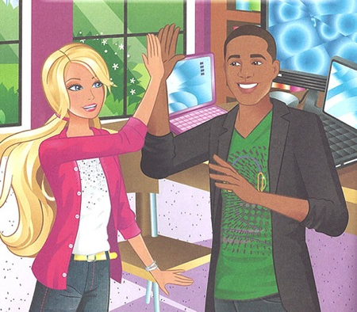

<h1>Hacker Barbie Visits The Agency</h1>

"We're just going to have to black bag them." Barbie was frustrated by the
lack of progress on the contract. Dismayed, her client Brian pleaded "But
you're the hacking goddess!" Barbie replied flatly "My gender has nothing to do
with whether or not it's possible to remote root an OpenBSD box with no ports
open.", making a mental note to talk to her PR firm about combating unrealistic
expectations.

"—and while he's distracted by Alpha team's 'pretty young thing', Bravo team
implants the servers." Barbie nodded in agreement, then teased "Are you glad you
listened when I told you to ask the Agency to check their databases and find out what porn he liked rather than just assuming things?" Steven laughed, a bit
sheepishly. "It's a solid plan. And you know, I'm really
impressed by how professional you've been about your role as the 'pretty
young thing'. I know it's your first field op, but you're going to be fine."

"Shit, they found the implant." Skipper asked "The one from last week?" Barbie
ignored her "Fuck that was an expensive op, three USB firmware zero-days burnt.
Fuck."

Skipper sighed "You seemed happier with your work back when I was helping you
with your masters." Barbie rolled her eyes, visibly annoyed "Yes, I know how
much you liked our Tor hardware router project—" Skipper finished her
sentence for her "—and then you graduated and somehow started an offensive
cyberwarfare consulting firm." "A <i>hardware security</i> consulting firm —
cyberwarfare stuff is the only clients I could find." It wasn't the first time
they'd had this conversation. "You're my sister and I'll always love you, but
this is about ethics in—"

Barbie cut her off "My Uber is here. Can we talk about this when I'm back from Utah?"

"Welcome to the Agency Infosecurity/National-Cyberassets Contractor
Pre-Clearance Orientation Course!"

It was the first time her team had visited the Agency in the flesh. Barbie was
genuinely looking forward to meeting the director, but still couldn't help but
wonder if
anyone would be able to remember that silly name by the end of the week. It was just
the kind of thing an Agency bureaucrat would come up with, or more likely, ten
of them.

"Can anyone tell me what Barbie's doing right that the rest of you aren't?"

Steven suddenly noticed the mesh on the windows. "She left all her non-approved
electronic devices outside the Faraday cage?"

"Good answer! The Faraday cage only protects against threats outside this room,
not inside. Barbie's got the right idea: in cyberwarfare the only thing you can
really trust with a secret is hardware you've audited yourself, like pen and
paper."

Barbie couldn't help but think how inconsistent the Agency's OPSEC was. Just
three days ago her team was in a Faraday cage being praised for keeping secrets
on pen and paper, yet now she was listening to the top brass giving Microsoft
PowerPoint presentations on laptops running Windows XP. How did they get so
complacent?

"—and with the domestic 'black bag' SSL key extraction program, we're up to
95% interception of—"

The director was just wrapping up her presentation; Barbie reminded herself to
ask her what supplier the purchasing department bought her cute pink
laptop from.

Took her almost a week this time, but she finally found it hidden between two
1U servers at the top of a rack. Barbie had enjoyed drawing since childhood,
and she kept it up as an excuse to get away from electronics every now and
then. Whenever she was going to spend a few days away from home she'd hide
something for Skipper to find - either one of her drawings, or a dummy covert
surveillance device.

"My sister is a good person, she's just been caught up in her surroundings."
Skipper thought to herself, "That's the problem with compartmentalisation: you
don't see the broader impact on society of the work you're doing."

Just then a message popped up on her Pond client: "hey sis, a client canceled
their contract so I've got two weeks off right after I get back. wanna do
nepal?"

Skipper was incredulous "They were using Windows XP and PowerPoint?! And they
let you bring your laptop in there?" Barbie explained "I couldn't believe it
when the director said even I could bring mine in so long as I didn't connect
it to any ethernet cables." She had a touch of anger in her voice "You're
supposed to compartmentalise the secrets, not the know-how on how to keep the
secrets secret." Skipper shook her head. "Kinda takes the magic out of working
for them doesn't it?" Barbie sighed, eyes downward and embarassed "I guess
that's what zero transparency gets you. I bought into the myth of the
all-knowing Agency hook, line, and sinker. They're just regular people." She
looked up at her sister "I'm sorry I didn't listen to you before." Skipper
hugged her warmly "I never doubted that you were a good person."

Skipper finally asked the big question "You think you stole enough info to go
public?" Barbie replied "I got thousands of Powerpoint slides off the personal
laptops in the audience—"

Amazed Skipper interrupted her "During your presentation on WiFi chipset
exploits?!" Barbie beamed "Ironic right? The director was really nice to me
after, she said I looked so nervous—"

"Because you were busy rooting her laptop right in front of her!"

"No! She tried to make me feel better by telling me how she'd read my paper and
removed the WiFi card!", Barbie exclaimed, still frustrated, "I got most of her
subordinates but it's all bureaucratic reports, not tech details. Think that's
enough?"

Skipper thought about it "The tech community is figuring out how the Agency
exploits targets, even crazy stuff like that Dual EC PRNG backdoor, or the
elliptic curve constants. But what the public cares about is who those targets
are."

"The reports prove that everyone is a target." Barbie said it with regret.
Skipper let it sink in "Feels different doesn't it?"

They spent a few quiet minutes together. Finally Barbie asked "So who's the
journalist you lined up to meet us over there?" Skipper tried, but couldn't
quite deliver the joke with a straight face "You'd know them from The Guardian,
a certain Bechdel T." Barbie laughed "Your codenames are the best!"

"Hey, one last pillow fight?"

<small>© 2014 Peter Todd, <a href="http://creativecommons.org/licenses/by-sa/4.0/">CC BY-SA 4.0</a></small>
